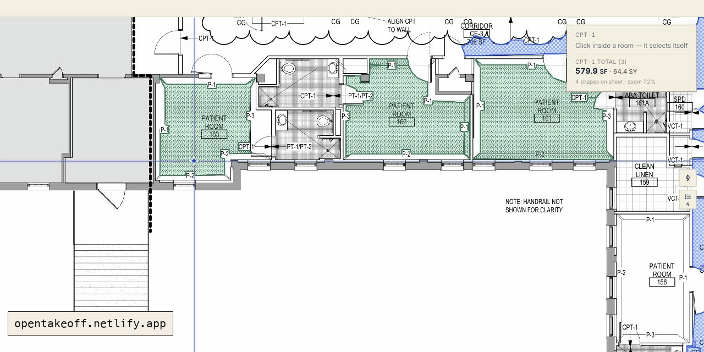

<div align="center">

# OpenTakeoff

> คำอธิบายฟีเจอร์บางส่วนในฉบับแปลนี้อาจเก่ากว่าฉบับภาษาอังกฤษ โปรดตรวจสอบสถานะล่าสุดได้ที่ [README ภาษาอังกฤษ](README.md) และ [Wiki กลาง](docs/wiki/README.md)

> **One-Click Area is temporarily gated.** The flood engine is being re-validated against a wider plan corpus. Until that finishes the One-Click tool is off the canvas rail (`O` reports the gate) and the `one_click` / `detect_rooms` MCP verbs are **not registered** (a default build ships <!--tool-count-->53<!--/tool-count--> tools). Trace rooms with **Area** (`A`) in the canvas and `measure_polygon` over MCP; every other tool, sweep and derivation is unchanged. A build lifts the gate with `VITE_ONE_CLICK=1` (canvas) / `OPENTAKEOFF_ONE_CLICK=1` (server). Sections and videos below that show One-Click describe the engine as it returns — see [`docs/design/ONE_CLICK_GATE.md`](docs/design/ONE_CLICK_GATE.md).

**เอนจินถอดปริมาณงานจากแบบก่อสร้าง — สร้างมาให้ AI Agent ขับเคลื่อนได้ และให้นักประมาณราคาอยากใช้จริง**

เปิดแบบก่อสร้างแล้ววัดได้ทันที — จะลากเส้นรอบห้องเอง หรือให้ AI Agent ทำงานบน **เอนจินตัวเดียวกัน** ก็ได้
ทุกค่าที่วัดจะบันทึก **มาตราส่วน** และ **วิธีที่วัด** ติดไปด้วยเสมอ ฟรี โอเพนซอร์ส
ทำงานในเว็บเบราว์เซอร์ — ไม่ต้องสมัครบัญชี ไม่มีการอัปโหลด ไม่ต้องติดตั้ง

[](LICENSE)
[](https://opentakeoff.kentucky-ai.com)
[](https://www.npmjs.com/package/opentakeoff-mcp)

[**▶ เปิดเดโมใช้งานจริง**](https://opentakeoff.kentucky-ai.com) · [เริ่มต้นใช้งาน](#เริ่มต้นใช้งาน) · [ฟีเจอร์](#ฟีเจอร์หลัก) · [สำหรับ AI Agent](mcp/) · [English](README.md) · [日本語](README.ja.md) · [한국어](README.ko.md) · [简体中文](README.zh-Hans.md)

<br/>



</div>

---

OpenTakeoff คือแคนวาสโอเพนซอร์สที่ใช้งานได้ฟรี สำหรับวัดปริมาณงานจากแบบก่อสร้าง —
หรือที่เรียกว่า **การถอดแบบ / ถอดปริมาณงาน** (takeoff) สิ่งที่ต่างออกไปคือ "ใครเป็นผู้ใช้งานได้"
คน **หรือ** AI Agent ขับเคลื่อน **เอนจินตัวเดียวกัน** คนลากเส้นรอบห้องบนแคนวาส ส่วน Agent
เรียกเครื่องมือชุดเดียวกันผ่าน [MCP](mcp/) แล้วได้ค่าเดียวกัน และทุกค่าที่วัดจะบันทึกว่า
**ได้มาอย่างไร** — มาตราส่วนเท่าไร วัดด้วยวิธีไหน คนวาดหรือ Agent วาด
หลักฐานเดินทางไปพร้อมกับตัวเลขเสมอ

ที่ผ่านมา **ยังไม่เคยมีแคนวาสถอดปริมาณงานแบบโอเพนซอร์สที่ทำงานบนเว็บ** — ยิ่งเป็นงานวัสดุปูพื้น
ยิ่งไม่มี OpenTakeoff คือเครื่องมือตัวนั้น เป็นทางเลือกจริงที่มอบให้วงการใช้ได้โดยไม่มีค่าใช้จ่าย

เดิมทีนี่คือโมดูลถอดปริมาณงานของแอปประมาณราคางานปูพื้นเชิงพาณิชย์ เราแยกออกมา ปรับปรุง แล้วเปิดเป็นสาธารณะ
**นี่ไม่ใช่เดโม แต่เป็นเอนจินวัดปริมาณที่ใช้งานจริง**

### รองรับระบบเมตริก

ใช้กับแบบก่อสร้างของไทยได้ทันที รองรับ **หน่วย ตร.ม. / ม.** และ **มาตราส่วนรูปแบบ 1:50, 1:100**
เป็นค่าพื้นฐาน มาตราส่วนจะถูกจำ **แยกตามแผ่นแบบ** (เพราะชุดแบบหนึ่งชุดแทบไม่เคยใช้มาตราส่วนเดียวกันทุกแผ่น)
และสลับไปใช้หน่วยอิมพีเรียลได้

ปริมาณที่ได้ส่งออกเป็น CSV / Excel เพื่อนำไปจัดทำ **บัญชีแสดงปริมาณงาน (BOQ)** ต่อได้

### แต่ UI ของแอปยังเป็นภาษาอังกฤษเท่านั้น

ขอบอกตรง ๆ ว่า การวัด ตัวเลข และการส่งออกไม่ขึ้นกับภาษา แต่ป้ายบนแถบเครื่องมือและเมนูตอนนี้
มีเฉพาะภาษาอังกฤษ และยังไม่มีเลเยอร์แปลภาษาของ UI การอ่านแบบและถอดปริมาณทำได้ตามปกติ
เพียงแต่ข้อความบนปุ่มเป็นภาษาอังกฤษ หากต้องการ UI ภาษาไทย
[แจ้งเราผ่าน issue ได้เลย](https://github.com/Kentucky-ai/opentakeoff/issues) —
หากคุณแปล UI ไว้ในฟอร์กของตัวเองแล้ว เรายินดีรับ PR กลับเข้ามาที่ต้นทาง

## เริ่มต้นใช้งาน

ถ้าแค่ต้องการใช้งาน ไม่ต้องติดตั้งอะไรเลย — เปิด [**เดโมใช้งานจริง**](https://opentakeoff.kentucky-ai.com)
แล้วลากไฟล์แบบมาวางได้ทันที

หากต้องการรันเอง:

```bash
cd web
npm install
npm run dev        # http://localhost:5173
```

ลากไฟล์ **`demo/sample-plan.pdf`** มาวางบนแคนวาส ระบบจะอ่านมาตราส่วนที่ระบุในแบบให้
เลือกเงื่อนไข (condition) กด **Area** (`A`) แล้วคลิกตามมุมห้องเพื่อลากเส้นรอบพื้นที่
เปิด **Report** เพื่อดูรายการสรุป แล้วส่งออกเป็น CSV / JSON / Excel

## ฟีเจอร์หลัก

| หมวด | รายละเอียด |
|---|---|
| **นำเข้า** | PDF, รูปภาพ, ชุดแบบ `.zip` — แตกไฟล์ในเบราว์เซอร์ หลายหน้า ดูเทียบกันได้สูงสุด 4 แผ่น |
| **มาตราส่วน** | อ่านมาตราส่วนที่ระบุในแบบ หรือปรับเทียบจากระยะที่ทราบค่า — จำแยกตามแผ่นแบบ |
| **การวัด** | พื้นที่ สี่เหลี่ยม ความยาว พื้นที่ผนัง นับจำนวน หักพื้นที่ (deduct) สรุปแยกตามโซน — เมตริก / อิมพีเรียล |
| **ตัวช่วยวาด** | ล็อกมุม 45°/90° (กด ⇧ เพื่อบังคับล็อก) แสดงมุมและความยาวเส้นข้างเคอร์เซอร์แบบเรียลไทม์ สแนปปลายเส้น (beta) |
| **เงื่อนไข (condition)** | สีและลายแฮตช์แบบ CAD แยกตามวัสดุ เปอร์เซ็นต์เผื่อเสียหาย ตัวคูณ ×N ความสูงผนัง ความหนา → แปลงเป็นพื้นที่บัวเชิงผนังและแถบขอบ |
| **วัสดุประกอบ** | วิธีติดตั้งและชนิดพื้นผิวรองรับ พร้อมแปลงกาว ซีลเลอร์ ยูรีเทน ปูนกาว ยาแนว ฯลฯ เป็นจำนวนที่ต้องสั่งตามอัตราการปกคลุม (ปัดขึ้นเป็นหน่วยเต็ม) |
| **รายงาน** | พื้นที่พื้น/ผนัง/บัวเชิงผนัง ความยาว จำนวน แยกตามเงื่อนไข ทั้งแบบรวมและไม่รวมเผื่อเสียหาย + รายการสั่งวัสดุ |
| **ส่งออก** | CSV, JSON, **Excel (.xlsx)**, พิมพ์, **ชุดแบบมาร์กอัป PDF** (แบบ + งานที่วัด + หน้าปกคำอธิบายสัญลักษณ์ สร้างในเบราว์เซอร์) |
| **จัดการรีวิชัน** | บันทึกผลถอดปริมาณทุกครั้งที่แบบประมูลมีการแก้ไข แล้วเทียบส่วนต่าง — ตามเงื่อนไข ตามแผ่นแบบ ตามรายการสั่งซื้อ |
| **มาร์กอัป** | คลาวด์ เส้นชี้ ข้อความโน้ต — อยู่คนละเลเยอร์และไม่ถูกนับรวมในปริมาณเด็ดขาด |
| **การแสดงผล** | โหมดสว่าง / **โหมดมืด (กลับสีแบบ)** — กลับสีที่พิกเซลของแบบตอนเรนเดอร์ ไม่ใช่ใช้ CSS filter |
| **การจัดเก็บ** | IndexedDB + localStorage — เก็บฝั่งไคลเอนต์ทั้งหมด ไม่มีการอัปโหลด |
| **เซิร์ฟเวอร์ MCP** | ขับเคลื่อนเอนจินจาก MCP client ผ่าน stdio — โหลดแบบ ตั้งมาตราส่วน วัดพื้นที่ ส่งออกผลถอดปริมาณ ([`mcp/`](mcp/README.md)) |
| **บันทึกที่มา** | ทุกรูปทรงบันทึกว่าวัดอย่างไร — มาตราส่วน วิธีวัด คนหรือ Agent และสถานะการตรวจรับ |
| **ดีพลอย** | สแตติกบิลด์ชุดเดียว ใช้ได้กับ Netlify, Vercel, GitHub Pages, S3 หรือโฮสต์สแตติกใดก็ได้ |

## ใช้งานจาก AI Agent

เอนจินเดียวกันนี้สื่อสารผ่าน [MCP](https://modelcontextprotocol.io) ได้ [`mcp/`](mcp/README.md)
คือเซิร์ฟเวอร์ stdio ที่ MCP client ขับเคลื่อนได้ รันด้วยคำสั่งเดียว — `npx -y opentakeoff-mcp`
มีเครื่องมืออย่าง `load_plan`, `read_sheet_text`, `set_scale`, `measure_polygon`, `view_sheet`,
`takeoff_summary`, `export_takeoff` และอื่น ๆ

Agent จะเปิดแบบ อ่านกรอบชื่อแบบ เลือกใช้มาตราส่วน (ไม่มีการตั้งค่าให้แบบเงียบ ๆ) วัดพื้นที่ห้อง
ตรวจงานตัวเองจากภาพเรนเดอร์ที่มีกริดวัดระยะที่ปรับเทียบแล้ว (`view_sheet`) จากนั้นส่งออกข้อมูลชุดเดียวกับที่แอป
บันทึกอัตโนมัติ — สูตรเดียวกัน บันทึกที่มาเดียวกัน ด่านตรวจมาตราส่วนเดียวกัน
งานที่ Agent วัดจะมีสถานะรอตรวจรับกำกับไว้ให้คนตรวจสอบก่อนเสมอ
วิธีตั้งค่าและตัวอย่างบทสนทนาเต็ม: [`docs/MCP.md`](docs/MCP.md) · [คู่มือสำหรับ Agent](docs/AGENT_GUIDE.md)

## ข้อมูลเป็นของคุณ

แบบ มาตราส่วน เงื่อนไข และมาร์กอัปทั้งหมดถูกบันทึกอัตโนมัติใน **เบราว์เซอร์ของคุณ** (IndexedDB + localStorage)
ไม่มีการอัปโหลดแบบ ไม่มีบัญชีผู้ใช้ และบิลด์มาตรฐานไม่มีเซิร์ฟเวอร์ หากโฮสต์สแตติกบิลด์เอง
ทุกอย่างก็ยังเป็นเช่นนั้น แม้ใช้การสั่งงานด้วยเสียง การรู้จำเสียงก็ประมวลผลบนอุปกรณ์ภายในเบราว์เซอร์
เสียงไม่ถูกส่งออกนอกเครื่อง

## งานวิจัยเบื้องหลัง

OpenTakeoff คือ "ครึ่งที่เปิด" ของโครงการวิจัยประยุกต์ ([Kentucky AI](https://kentucky-ai.com))
ที่ดำเนินการโดยนักประมาณราคางานปูพื้นเชิงพาณิชย์ที่ยังทำงานประมูลจริงอยู่ เส้นแบ่งนี้ตั้งใจวางไว้
และเป็นเส้นเดียวกับที่ซอฟต์แวร์วิทยาศาสตร์แบบ open-core ที่ดีใช้กัน —
**เอนจินวัดปริมาณ (เรนเดอร์ มาตราส่วน เรขาคณิต การส่งออก เซิร์ฟเวอร์ MCP) เปิดเป็น Apache-2.0 ต่อไป
ส่วนโมเดล AI ที่ฝึกจากคลังงานประมาณราคาของเราเองเป็นกรรมสิทธิ์**
คุณได้เครื่องมือจริงที่ไม่มีค่าไลเซนส์รายที่นั่ง เราเก็บส่วนที่สร้างได้จากข้อมูลของเราเท่านั้น

ผลงานวิจัยที่เผยแพร่ (model card สเปกเบนช์มาร์ก บทความ):
[Hugging Face](https://huggingface.co/Kentucky-ai) · [kentucky-ai.com](https://kentucky-ai.com)

## สร้างต่อยอด

OpenTakeoff ใช้สัญญาอนุญาต **Apache-2.0** ฟอร์ก แก้ไข และนำไปใช้งานได้ — จะเพื่อทีมของคุณ
หรือเป็นฐานของผลิตภัณฑ์ของคุณก็ได้ ขอเพียงคงไฟล์ [LICENSE](LICENSE) และ [NOTICE](NOTICE)
ไว้ในงานที่เผยแพร่ต่อตามเงื่อนไขของ Apache-2.0 โค้ดเบสถูกดูแลให้เล็กและอ่านง่ายโดยตั้งใจ:

- **เรขาคณิตและการวัด** — [`web/src/lib/oneclick.ts`](web/src/lib/oneclick.ts), [`web/src/lib/sheets.ts`](web/src/lib/sheets.ts) (มี type และมีเทสต์)
- **การสรุปยอดและคำนวณวัสดุ** — [`web/src/lib/totals.js`](web/src/lib/totals.js)
- **สเตตและการจัดเก็บ** — [`web/src/lib/store.js`](web/src/lib/store.js)
- **UI** — [`web/src/pages/TakeoffCanvas.jsx`](web/src/pages/TakeoffCanvas.jsx), [`web/src/components/`](web/src/components/)

ก่อนส่ง PR ให้รัน `npm run typecheck && npm test && npm run build` คงไลบรารีเรขาคณิตให้เป็น
ฟังก์ชันบริสุทธิ์ที่มีเทสต์ และห้าม commit แบบก่อสร้างของโครงการจริงเด็ดขาด
ดู [CONTRIBUTING.md](CONTRIBUTING.md) และ [คู่มือผู้ใช้](docs/USER_GUIDE.md)

**ยินดีรับการมีส่วนร่วม** เขียน issue หรือ PR เป็นภาษาไทยได้ — เราจะแปลและตอบกลับ
issue ที่ติดป้าย [`good first issue`](https://github.com/Kentucky-ai/opentakeoff/labels/good%20first%20issue)
มีขนาดเล็ก สเปกชัดเจน และระบุไฟล์ที่เกี่ยวข้องไว้แล้ว PR ที่มีเทสต์และ CI ผ่านจะถูก merge อย่างรวดเร็ว

## เทคโนโลยีที่ใช้

- **ฟรอนต์เอนด์:** React 18 + Vite (JSX ล้วน)
- **การวาด:** HTML5 Canvas + SVG ล้วน (ไม่ใช้เฟรมเวิร์กวาดภาพ)
- **เรขาคณิต:** TypeScript (`oneclick.ts`, `sheets.ts`)
- **เรนเดอร์ PDF:** [pdf.js](https://github.com/mozilla/pdf.js)
- **นำเข้าชุดแบบ:** fflate (zip) + pdf-lib (รูปภาพ → PDF) โหลดเมื่อใช้งาน
- **การจัดเก็บ:** IndexedDB + localStorage — ไม่ต้องมีแบ็กเอนด์
- **เทสต์:** `node --test` + `tsx`
- **ไม่มี dependency ที่ต้องเสียเงิน** ดู [THIRD-PARTY-NOTICES.md](THIRD-PARTY-NOTICES.md)

## สถานะ

OpenTakeoff ไม่ใช่รุ่นพรีวิว แต่เป็น **เครื่องมือที่ใช้งานจริง** เอนจินวัดปริมาณ — เงื่อนไข วัสดุประกอบ
รายงาน และการส่งออก — คือเอนจินโปรดักชันที่แยกออกมาจากแอปประมาณราคางานปูพื้นเชิงพาณิชย์
**Snap** ยังเป็น beta และ **One-Click Area** ปิดใช้งานชั่วคราวตามประกาศด้านบน
ปัจจุบันใช้ในการประมูลงานปูพื้นเชิงพาณิชย์จริง

## สัญญาอนุญาต

[Apache License 2.0](LICENSE) — ใช้ ฟอร์ก เผยแพร่ และสร้างต่อยอดได้
ดูการระบุที่มาของผลงานที่ [NOTICE](NOTICE)

---

> **เกี่ยวกับฉบับภาษาไทยนี้** ต้นฉบับคือ [README.md](README.md) ภาษาอังกฤษ ฉบับแปลนี้เป็นฉบับย่อ
> และอาจตามฟีเจอร์ล่าสุดไม่ทัน หากเนื้อหาไม่ตรงกันให้ยึดฉบับภาษาอังกฤษเป็นหลัก
> ดูรายการฟีเจอร์ทั้งหมดที่ [FEATURES.md](FEATURES.md) และประวัติการเปลี่ยนแปลงที่ [CHANGELOG.md](CHANGELOG.md)
> หากพบคำแปลผิดพลาด โปรดแจ้งผ่าน issue หรือ PR จะขอบคุณมาก
