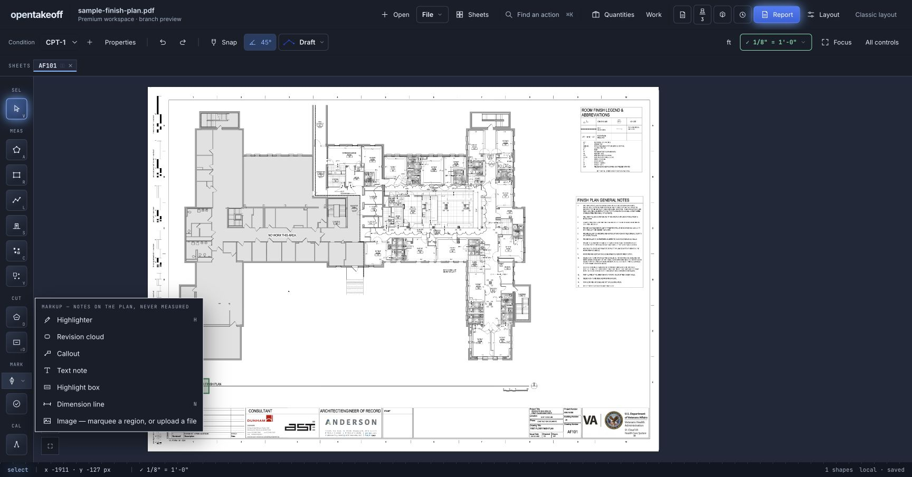
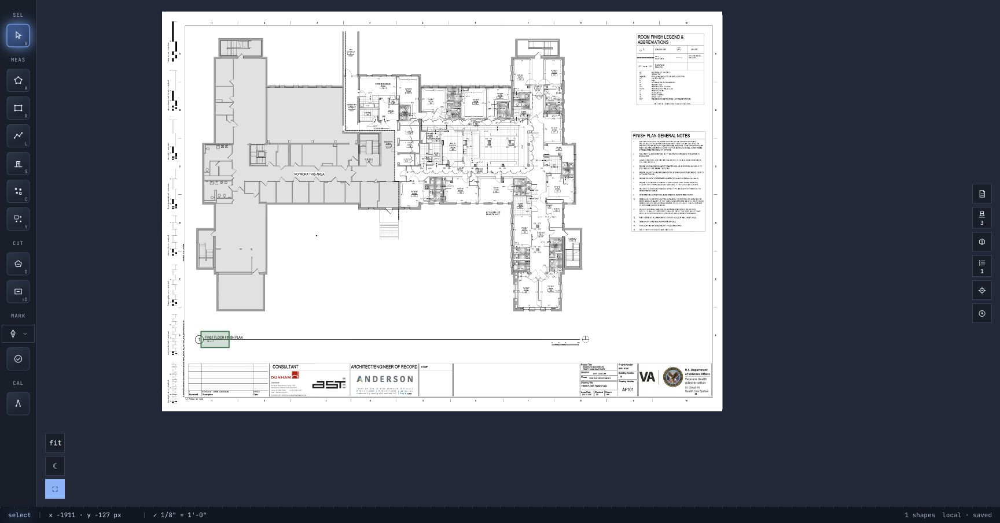

# Premium workspace branch review

## Scope

Opt-in `?workspace=premium` builds on the existing Workspace preview: graphite, light and HUD surfaces; personal backlight/readout settings; panel controls beside Quantities that move to the right in Focus mode; larger gallery cards and a separate detailed sheet preview. Existing measuring, review and material handlers remain in use.

Create annotation stays in the drawing toolbar. Markup list opens existing annotations and uses a document icon. Draft remains beside Snap and 45°. The project quantity counter and floating readout are independent preferences.

## Current evidence — 2026-09-15





Screenshots use the bundled public sample plan. Earlier workspace verification documents describe earlier iterations; they are not proof of every change on this branch.

### Browser checks

- Opened the left annotation creation menu and the top Markup list independently; both expose their original actions.
- Entered Focus: header hidden, right panel rail visible. Exited Focus: header restored, right panel rail hidden.
- Opened Quantities and a condition’s supporting-material editor in an isolated project copy.
- Toggled the floating readout, changed workspace surface and opened Draft’s four conventions.
- Rendered detailed preview at 2400 × 1715 pixels. Escape closed the preview while retaining the gallery; the next Escape returned to the canvas.
- Compared the isolated project before/after layout and panel operations using `web/review/workspace-integrity.html`: all nine checks matched, including geometry/quantities, complete shape records, condition/material records, scales, markups and RFIs. Private source records and project images are retained locally only. This verifies preservation, not estimating accuracy.

### Automated checks

```sh
npm run check --prefix web
npm run check:tool-count --prefix mcp
npm run check:wiki --prefix mcp
npm run check --prefix protocol
node scripts/check-doc-links.mjs
```

Web: 1,795 tests, 1,792 passed, 3 skipped, 0 failed; typecheck, lint, benchmark and production build passed. Protocol: 61 passed, 0 failed. Tool-count, wiki and document-link checks passed.

## Remaining review

This is a draft for branch review. Native iPad/mobile workflows, premium sign-up/lead collection, and full Spline parity are separate phases. Tablet/phone interaction and complete export/reimport workflows have not been reverified for this iteration. No claim of universal usability parity is made.

## Reproduce the preservation check locally

1. Start the development server on a separate loopback port and import a disposable project copy.
2. Open `/review/workspace-integrity.html` on that same origin and capture a baseline.
3. In the canvas, change appearance/readout preferences and open/close panel tools, including Focus mode. Do not edit project content during this test.
4. Return to the checker and compare. Every check should be true. The checker reads browser storage and stores only the baseline hashes in tab session storage; it does not upload or change project content.
