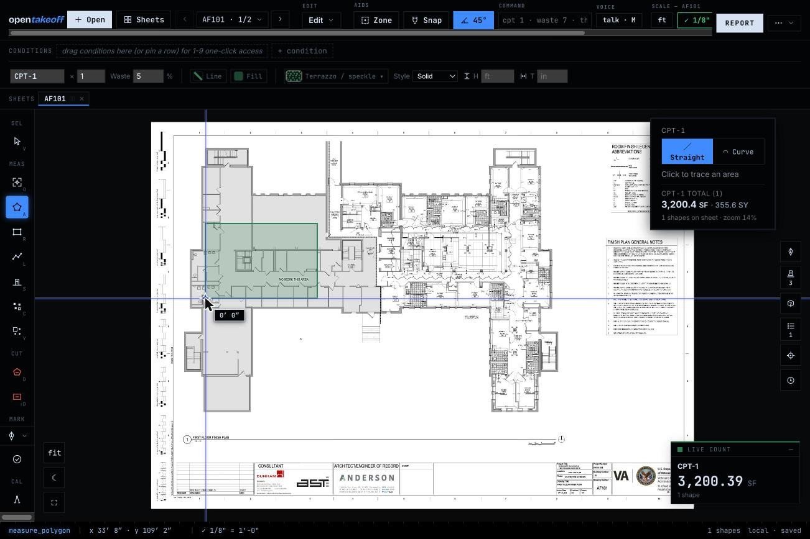

# Live counter — live verification

Checked against the running app (Vite dev, Chromium): a fresh workspace on the
bundled `demo/sample-finish-plan.pdf`, and a five-sheet workspace with six
conditions carrying ~24 shapes.

| Claim | Live result | ✓ |
|---|---|---|
| Hidden until a condition carries shapes | fresh sample-plan workspace: no widget at 0 shapes | ✓ |
| Appears and counts on the first commit | traced one CPT-1 area → widget appeared: **CPT-1 · 3,200.39 SF · 1 shape**, agreeing with the panel chip (3,200.4 SF · 355.6 SY) | ✓ |
| Every condition with shapes gets a row | six-condition workspace: lead + 5 rows (WD-1 2,935.73 · VCT-1 4,924.54 · SV-1 546.48 · CT-1 2,267.34 · TR-1 1,911.58 · CPT-1 11,605.04 SF) | ✓ |
| Clicking a row activates that condition | clicked WD-1 → lead swapped LVT-1 → **WD-1 · 2,935.73 SF** | ✓ |
| Header drag moves it; position persists | dragged from the default dock → inline `left/top` matched `localStorage` `ot.liveCounterPos.v1` `{"x":621.5,"y":400.5}` exactly; ⌖ redock affordance appeared | ✓ |
| Survives reload | full page reload: widget back with the same totals (CPT-1 · 3,200.39 SF · 1 shape) | ✓ |
| Measured, not order quantities | unit-tested: deducts net out, `waste_pct` ignored, LF/EA under their units — built through the real `conditionTotals` | ✓ |

## Capture

First committed shape on the bundled sample plan — the widget in its default
dock, agreeing with the CPT-1 panel chip:

**Not exercised live:** the collapse chip round-trip (state + persistence are
the same `loadStored`/`saveStored` pair the position uses; worth one click
when driving the branch).

`npm run check` green on Node v24.18.0.
