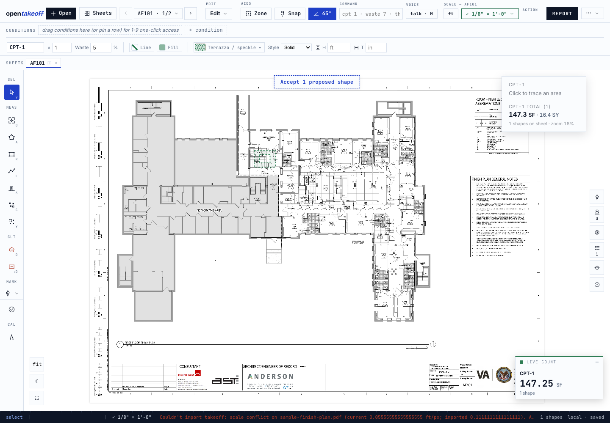
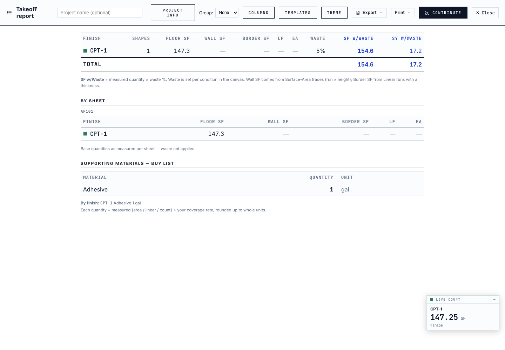

# Measurement correctness — live verification

Verified in a disposable Chromium profile against the Phase 1 branch, using the
existing bundled `sample-finish-plan.pdf`. These are correctness fixtures drawn
over the sample, not claims about automatically detecting its architectural rooms.

| Check | Expected | Observed |
|---|---|---|
| Confirm a previously unconfirmed scale, then reload | Confirmation remains without a shape edit | Passed |
| Hydrate legacy agent work without a review flag | One pending proposal, not automatic approval | Passed |
| Persist an interior void | Hole remains after reload and recalibration | Passed |
| Import the same sheet at twice its locally calibrated feet per pixel | Atomic refusal; shape count and prior work unchanged | Passed |
| Change from 1/8-inch scale to 1/4-inch scale | Feet per pixel halves; area is divided by four | Passed within 0.02 SF of the expected quarter-area |
| Revert the scale | Original calibration and quantity return together | 147.25 SF restored; Report displays 147.3 SF |
| Browser runtime | No uncaught page errors | None observed |

The explicit MCP rectangle check uses a 360-by-360-pixel polygon: at `upp: 1/36`,
expect 100 SF / 40 LF; at `upp: 1/18`, expect 400 SF / 80 LF. Unit tests check stored
metrics, report and DXF values, then undo back to the original calibration.

## Reproduce

Use Node 24, then run `cd web && npm run check`. Start the app with
`npm run dev -- --host 127.0.0.1 --port 5187` and follow the browser and MCP steps
in [the Phase 1 test guide](../PHASE_1_TESTING.md).

The final correctness-only run passed typecheck, lint, 1,711 web tests, benchmark
and production build. MCP validation passed 197 tests, typecheck, tool count,
build and distribution smoke checks. No benchmark golden changed.

Live two-device cloud sync remains a manual check. Pure merge tests and the
isolated store integration test cover calibration conflicts and backup before
adoption; they do not substitute for an authenticated two-device exercise.
