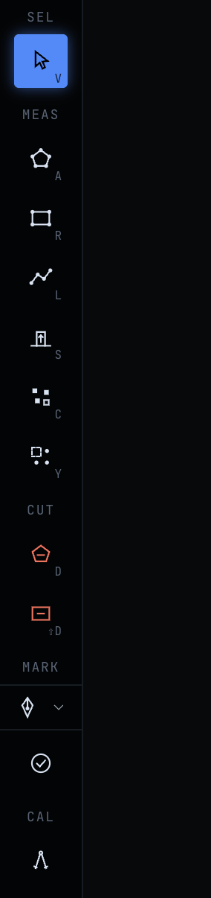

# One-Click gate — live verification

Companion to [`ONE_CLICK_GATE.md`](ONE_CLICK_GATE.md). Everything below was captured from the
real running code on this branch, not from mocks: the canvas on `localhost:5199` (Vite, Node
24) and the stdio MCP server started with `node --import tsx server.ts`.

## Canvas (gate up — a plain build, no `VITE_ONE_CLICK`)

The MEAS rail has no One-Click tile; Area (`A`) leads it:



Pressing `O` arms nothing and the message bar reports the gate:


The existing workspace (twelve sheets, nine conditions, 1,431.04 SF of LVT-1 already traced)
loaded unchanged: stored shapes keep their provenance, the Takeoffs panel and the live counter
read the same numbers, and the topbar, scale chip and Report are untouched.

## MCP server (the real stdio process, `initialize` + `tools/list`)

```
[default] server 0.9.73 · instructions 3185 chars · gate note present: True
[default] step 2: 2. Commit shapes under finish-tag conditions (measure_polygon / measure_line with `condition`; a room's polygon is its wall faces — read them with get…
[default] tools/list: 45 tools · one_click listed: False · detect_rooms listed: False
[default] descriptions naming a gated verb: none

[lifted] server 0.9.73 · instructions 2761 chars · gate note present: False
[lifted] step 2: 2. Commit shapes under finish-tag conditions (one_click / detect_rooms / measure_polygon / measure_line with `condition`; when the set carries a room-…
[lifted] tools/list: 47 tools · one_click listed: True · detect_rooms listed: True
[lifted] descriptions naming a gated verb: ['sheet_info', 'detect_rooms', 'measure_surface', 'place_count', 'get_sheet_vectors', 'edit_shape', 'edit_materials', 'undo_last', 'sheet_graph', 'find_text', 'view_sheet', 'annotate']
```

- Default: **45 tools**, neither gated verb listed, the gate note in the initialize
  instructions, step 2 of the standard finish names `measure_polygon`, and no description
  on the wire names `one_click` or `detect_rooms`.
- `OPENTAKEOFF_ONE_CLICK=1`: **47 tools**, both verbs back, the note gone, the original step 2,
  and the twelve descriptions that reference the verbs read exactly as before.

## Gates run on this branch (Node v24.18.0)

| Gate | Result |
|---|---|
| `web`: `npm run check` (typecheck · lint · test · bench · build) | green, bench goldens unchanged |
| `web/test/gate.test.ts`, `guideParity.test.ts` | pass (the `O` row left USER_GUIDE §15 and the overlay together) |
| `mcp`: `npm run typecheck` + `npm test` | 201 / 201 |
| `mcp/test/gate.test.ts` | both surfaces pinned |
| `npm run build` + `npm run smoke:dist` | dist server lists exactly `TOOL_NAMES` (45) |
| `npm run check:tool-count` | 4 markers, 0 stale, 45 |

## Reproduce

```
cd web && npm run check
cd mcp && npm test && npm run build && npm run smoke:dist
# the wire, default and lifted:
printf '%s\n' '{"jsonrpc":"2.0","id":1,"method":"initialize","params":{"protocolVersion":"2025-06-18","capabilities":{},"clientInfo":{"name":"x","version":"0"}}}' '{"jsonrpc":"2.0","method":"notifications/initialized"}' '{"jsonrpc":"2.0","id":2,"method":"tools/list"}' | node --import tsx server.ts
OPENTAKEOFF_ONE_CLICK=1 … same pipe …
```
