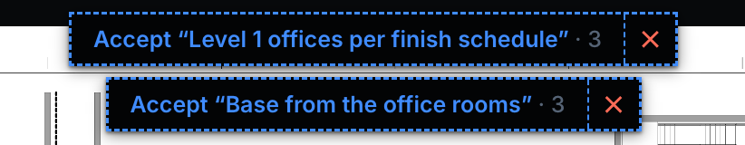
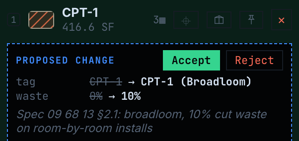
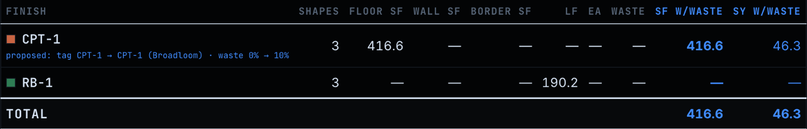

# Proposals — live verification

Companion to [`PROPOSALS.md`](PROPOSALS.md). Everything below was captured from the real
running code on this branch, not from mocks: the canvas on `127.0.0.1:5240` (Vite, Node
24.18.0) and the stdio MCP server started with `node --import tsx server.ts`.

## The fixture

A headless `Session` on the bundled `demo/sample-finish-plan.pdf` (scale `use_detected`) ran
the agent's side of the story and wrote `export_takeoff`:

1. `propose_takeoff "Level 1 offices per finish schedule"` → three rooms flooded from their
   schedule-corroborated tag centers (CONFERENCE/BREAK 134 · 214.06 SF, LAUNDRY 153 ·
   109.51 SF, OFFICE 136 · 93.07 SF) under `CPT-1`, each labeled with its room.
2. `propose_takeoff "Base from the office rooms"` → `derive_base` over the `CPT-1` rooms onto
   `RB-1` (three runs, 190.24 LF).
3. `propose_condition_edit CPT-1 {waste_pct: 10, finish_tag: "CPT-1 (Broadloom)"}` with the
   spec citation as rationale.

`takeoff_summary` on that session reported two batches (3 pending each, the second current)
and one pending condition diff. The export carried `proposals` and `condition_edit_proposals`.

## Canvas

**Import.** Sheet menu → *Import takeoff…* on the sample plan (no scale set, so the import's
calibration was adopted; the scale chip shows `1/8" = 1'-0" — confirm`). The message bar:
*Imported 6 shapes · 6 dashed pending your review — Accept turns pencil to ink · 2 new
conditions.* Two pills, one per batch, instead of one *Accept 6 proposed shapes*:



**The condition diff under its row.** Takeoffs panel, `CPT-1` row, with the row and every total
still on the current values (waste 0, 416.6 SF):



**The report.** The `CPT-1` row prints the current knobs and the proposed values beside them;
SF w/waste is still 416.6:



**The gestures**, each checked in the DOM after the click:

| Gesture | Result |
|---|---|
| Accept the first pill | the three rooms render solid; the pill is gone; the bar reads *Accepted “Level 1 offices per finish schedule” — 3 shapes — pencil is now ink (⌘Z undoes).* |
| `⌘Z` | both pills back; the rooms dashed again (one undo entry for the batch) |
| ✕ on the base pill | *3 shapes on sheet* (from 6); the base pill gone |
| `⌘Z` | *6 shapes on sheet*; both pills back |
| Accept on the condition strip | the row reads `CPT-1 (Broadloom)`, the Waste box reads 10, the strip is gone; bar: *Accepted the proposed change on CPT-1 (Broadloom).* The pinned palette, the live counter and the hover readout all follow the rename. |
| Reload | both pills, the renamed condition, and 6 shapes come back from the autosave — proposals persist in the workspace payload |

## MCP server (the real stdio process, `initialize` + `tools/list`)

```
server 0.9.74
tools/list: 50
proposal verbs: propose_condition_edit, propose_takeoff, revise_proposal, withdraw_condition_edit, withdraw_proposal
revise_proposal input keys: proposal_id,shapes | shapes.items keys: sheet,condition,role,verts,label,height_ft
```

`npm run check:tool-count` rewrote the four markers to 50; `mcp/test/tools.test.ts` pins the
list, `staging.test.ts` the stage partition, `gate.test.ts` both gate surfaces (50 / 52).

## Gates

- `web/`: `npm run check` — typecheck, lint, tests (incl. the new `proposals.test.ts`), bench
  unchanged, build. Green on Node v24.18.0.
- `mcp/`: `tsc --noEmit` + `npm test` — 212 passing, 0 failing, incl. the new
  `proposals.test.ts` and the conformance flow's wire pass over every new verb and every new
  `undo_last` op.
