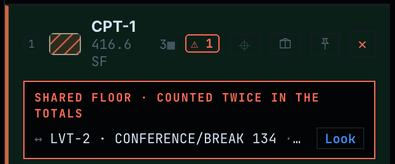
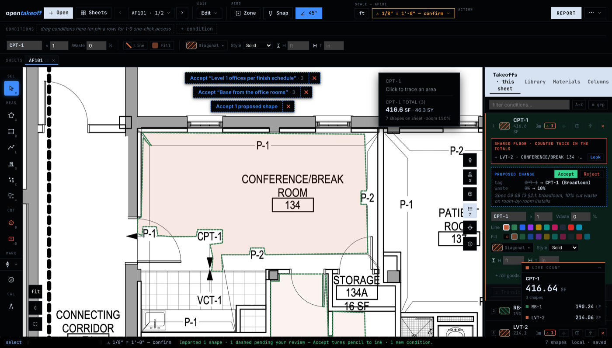

# Scope collision — live verification

Companion to [`SCOPE_COLLISION.md`](SCOPE_COLLISION.md). Everything below was captured from the
real running code on this branch, not from mocks: the canvas on `127.0.0.1:5240` (Vite, Node
24.18.0; captures through headless Chrome at 2×) and the stdio MCP server started with
`node --import tsx server.ts`.

## The fixture

On the bundled `demo/sample-finish-plan.pdf`, the proposals fixture from
[`proposals-verification.md`](proposals-verification.md) (three `CPT-1` rooms flooded from their
schedule tags, three `RB-1` base runs) plus a second headless session that flooded **the same
room 134 under `LVT-2`** — the accidental collision #366 describes: a second agent, a second
session, or the estimator on another day, claiming a floor that is already claimed.

## Canvas

After both imports the `CPT-1` and `LVT-2` rows wear the badge, and the active row lists the
pair — the other condition, the room label, `214.06 SF shared · 100%` (room 134 is entirely
inside both rings) — with **Look**:



**Look** frames the pair (the canvas reads `zoom 150%` afterwards) with both dashed rings over
CONFERENCE/BREAK ROOM 134, the badge and the list on the panel, and the earlier proposal pills
and condition-edit strip still in place — nothing else on the takeoff moved:



`LVT-2`'s row shows the same pair from its side. The number on the wire for this workspace is
the same `214.06` (`takeoff_summary.shared_floor_sf`), because the badge and the verb read one
module.

## MCP server (the real stdio process, `initialize` + `tools/list`)

```
server 0.9.75
tools/list: 52
scope verbs: scope_duplicates, scope_merge
scope_duplicates input keys: sheet,min_fraction
scope_merge input keys: shape_a,shape_b,winner
```

`npm run check:tool-count` rewrote the four markers to 52; `tools.test.ts` pins the list,
`staging.test.ts` the stage partition, `gate.test.ts` both gate surfaces (52 / 54).

## Over the wire (`mcp/test/conformance.test.ts`)

- The bundled sample plan's conformance takeoff: `scope_duplicates` → `[]`, `[]`, `0`, `[]`;
  `takeoff_summary.shared_floor_sf` → **0**.
- A deliberate 100 % overlap (`LVT-9` over the `VCT-1` polygon) → one collision, fraction 1,
  `shared_floor_sf` equal to the pair's shared SF, the summary agreeing.
- `scope_merge` with neither shape reviewed and no winner → refused; with the winner stated →
  `deleted` (near-total), `shared_floor_sf` back to 0; `undo_last {n: 2}` → `delete`, `commit` —
  the session exactly as before.

## Gates

- `web/`: `npm run check` — typecheck, lint, tests (incl. `scopeCollision.test.ts`, whose last
  case runs the room eval's `batchMetrics` and this module over the same rings and asserts the
  same duplicate pairs), bench unchanged, build. Green on Node v24.18.0.
- `mcp/`: `tsc --noEmit` + `npm test` — 218 passing, 0 failing, incl. `scope.test.ts`.
