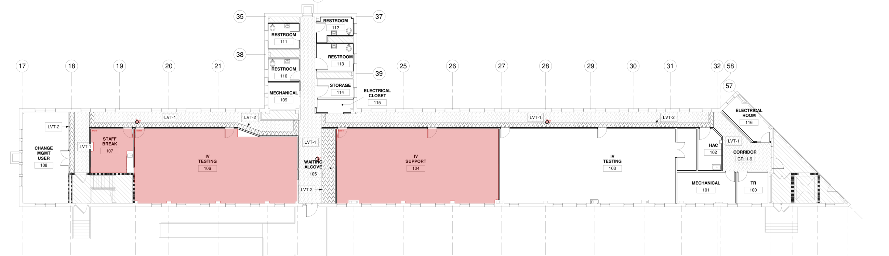
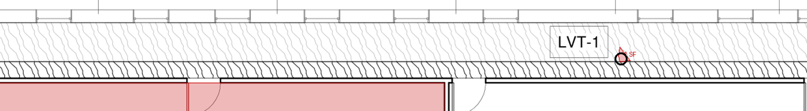
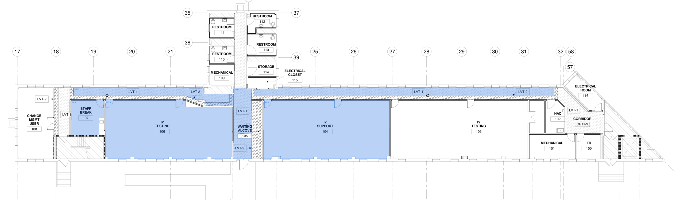
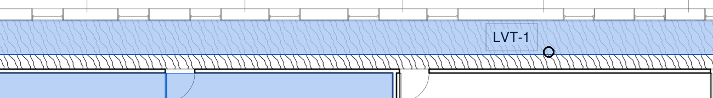
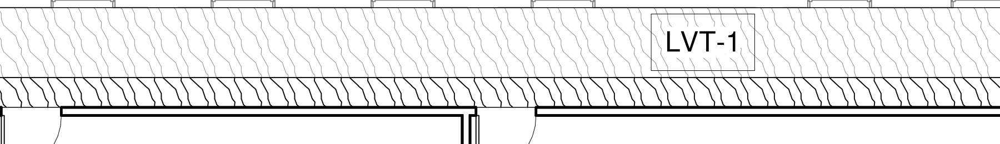

# Stroke texture — verification

Engine output, not mock-ups. Every image is the shipped mask-and-flood path run headless on `bench/open-sheets/va-dublin-bldg9a-finish-plan-A601.pdf` (agents branch, 1/8" = 1'-0", 18 px/ft at render scale 2) with the same ink context the app passes: subpaths, text marks, dimension texts. Seeds are marked with black circles.

## Before

Rooms close. The corridor seeds (grid 26, grid 20, the alcove) return 1–2 SF cells.

## After

Corridor CR11-10 is one polygon, 420 SF, 124.5 × 3.4 ft, identical from both corridor seeds. Rooms are unchanged to the square foot (Staff Break 107 gains 1 SF: its room tag frame no longer counts as a hole).

## What the field is

The corridor at 4×: LVT-1 stipple above, the south wall's hatched poché below. The stipple strokes are straight single segments at every angle; the poché is axis-aligned. That orientation split is the second gate.

## Regression, bundled VA plan

`web/bench/corpus/va-finish-plan.json`, nine probes, run through the ink path before and after:

| probe | before | after | golden |
| --- | ---: | ---: | ---: |
| patient-room-137 | 215.5 | 215.5 | 202.1 |
| patient-room-137-band | 22.3 | 22.3 | 20.7 |
| patient-toilet-137a | 40.6 | 40.6 | 41.2 |
| elevator-e01 | 143.5 | 142.7 | 142.6 |
| ward-room | 237.0 | 237.0 | 235.3 |
| ward-vestibule | 68.9 | 68.9 | 68.9 |
| cloud-corridor | 1726.1 | 1726.1 | 1743.1 |
| shaded-wing-office | 155.2 | 155.2 | 160.5 |
| open-margin | refusal | refusal | refusal |

## Reproduce

Unit tests: `node --import tsx --test test/geometry.test.ts` (six stroke-texture tests, five tag-frame tests). Full gate: `npm run check`.
