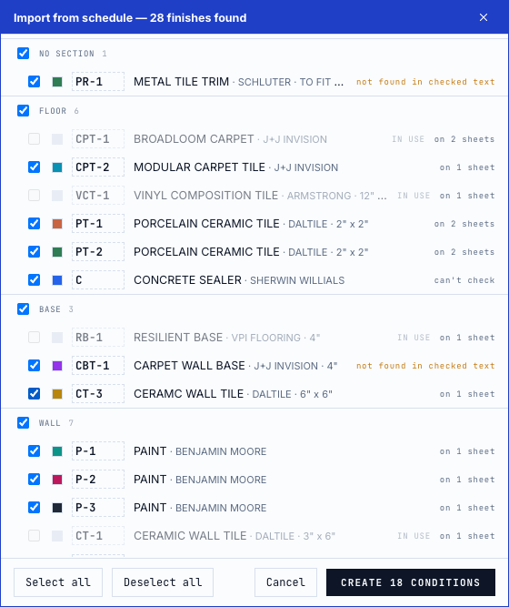
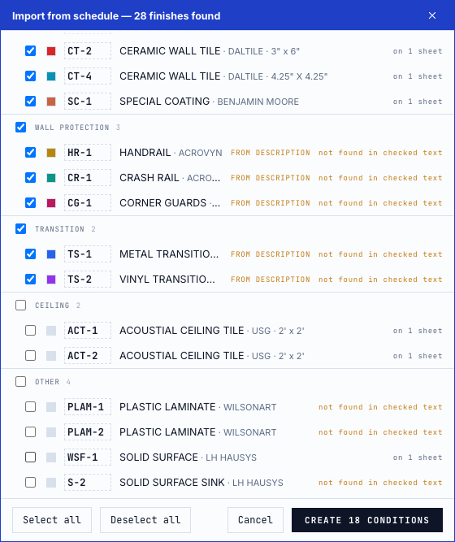
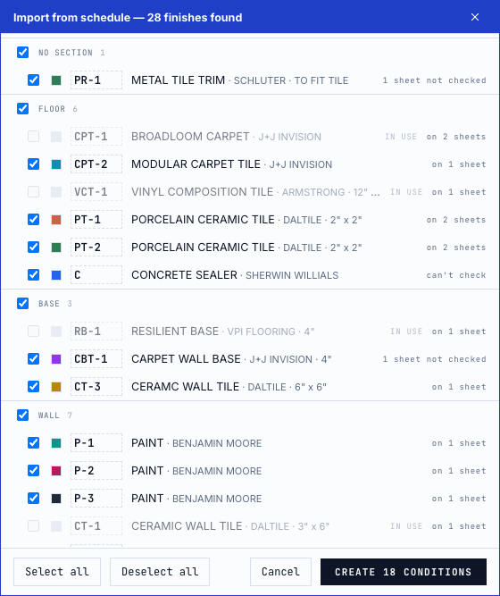
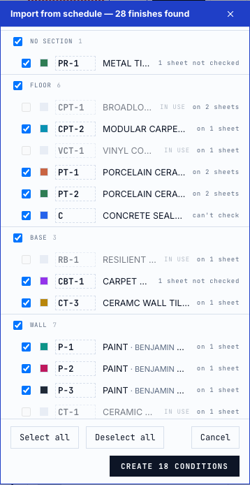

# Is the imported code on the plans? — #498 review evidence

Import from schedule now marks each row with whether its code (as edited) is
printed elsewhere in the set, read from the plan-search index: **on N sheets**,
**not found in checked text**, **N sheets not checked**, or **can't check**.
The marker is information only: it never unticks a row.

Every screenshot is the bundled sample plan (`web/public/demo/sample-finish-plan.pdf`,
AF101 floor plan + AF600 schedules), plus `demo/sample-plan.pdf` from this
repository for the scan case. No private plans. Local Chrome 154 (headless),
Node 24.18.0, branch `feat/498-code-not-on-plans` on main `ef14056e`,
October 10, 2026.

## Material schedule on AF600, every sheet checked

Box drawn around AF600's MATERIAL SCHEDULE (28 rows), after AF101 and AF600 were
opened (both indexed and measured).

| Marker | Rows | Expected (from the PDF's own text) | Observed |
|---|---:|---|---|
| on 2 sheets | 3 | CPT-1, PT-1, PT-2 printed on AF101 and outside the box on AF600 | 3 |
| on 1 sheet | 13 | printed outside the box on AF600 only (its room finish schedule) | 13 |
| not found in checked text | 11 | PR-1, CBT-1, HR-1, CR-1, CG-1, TS-1, TS-2, PLAM-1, PLAM-2, S-1, S-2: printed only inside the box | 11 |
| can't check | 1 | `C`: one letter, a term plan search never keeps | 1 |

"Expected" was counted independently with pdf.js over both pages' text items,
splitting each run on whitespace, `/` and `,`, and classing each occurrence as
inside or outside the box's page rectangle. Default ticks are unchanged: Create
18 conditions, as on main.



Editing a code re-checks it: `S-1` edited to `WSF-1` (printed in AF600's room
finish schedule) reads **on 1 sheet**.



## A sheet that can't be checked yet

`demo/sample-plan.pdf` added to the set. Its text layer has 4 lines, so the
app's scan rule treats it as a scan with no read, and every code not found on
the other two sheets says **1 sheet not checked** instead of "not found". Found
codes still say where they were found.



At 390 px wide the dialog keeps its 356 px width with no horizontal scroll
(`scrollWidth` = `clientWidth` = 356).



## Exact identities

`web/test/codeUse.test.ts` holds every case from the
[#498 comment](https://github.com/Kentucky-ai/opentakeoff/issues/498#issuecomment-5973205424) table, with invented codes:

| Imported | Other sheet's text | Result |
|---|---|---|
| CPT-1 | CPT-1 | found, badged text |
| CPT-1 | CPT-12 | not found; CPT-12 listed as similar |
| P-1 | P-110 | not found; P-110 similar |
| CPT-1 | CPT-1A | not found; CPT-1A similar |
| P-1 | P1 | not found; P1 similar |
| G-01(C) | G-01 (W) | not found; G-01 similar |
| G-01(C) | G-01(C) | found |
| LVT-2 | CPT-1/LVT-2 | found (callout member) |
| CPT-1 | one live sheet not indexed | unchecked, 1 sheet |
| CPT-1 | file with page count unknown | unchecked |
| CPT-1 | seeded entry only | unchecked |
| CPT-1 | pictures `"failed"` or not measured | unchecked |
| CPT-1 | a scan with no read / with its read | unchecked / found, badged OCR |
| CPT-1, LVT-2 | a hybrid's read (text-layer term / picture term) | found, text / found, OCR |
| CPT-1 | only on the schedule's own sheet | not found |
| CPT-1 | `set.pdf#2` when the schedule is `set.pdf` | found on `set.pdf#2` |
| CPT-1 | on the schedule's sheet beyond the box's own count | found there, "outside the box" |
| C | anywhere | can't check |

## Reproduce

```sh
cd web
node --import tsx --test test/codeUse.test.ts      # 20 pass
npm run check                                      # typecheck, lint, tests, bench, build
npm run dev
```

1. **Just open the sample plan**, open **Sheets** → **AF600**, then **Classic
   layout**.
2. **⋯ → Import from schedule**, click two corners around the MATERIAL SCHEDULE
   (top middle of AF600). Expect the counts above.
3. Hover a marker for the sheets it names, or the similar codes.

## Limits

- Only text the index holds counts: a code drawn as linework, a block attribute,
  or text inside an unread picture can't be seen, which is why the label is
  "not found in checked text", never "unused".
- A sheet is only checked once it is indexed: the canvas indexes the sheets it
  shows, and opening **Sheets** indexes the rest. The dialog doesn't start an
  indexing walk of its own.
- On the schedule's own sheet, only occurrences beyond the box's own count are
  evidence, and only when the box was read from the text layer. A raster box
  (on-device read) excludes its sheet entirely.
