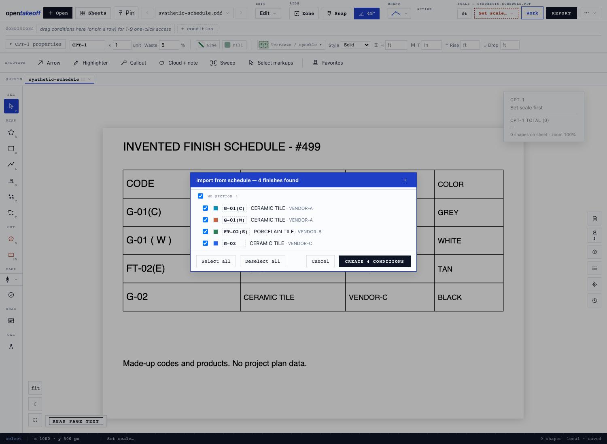
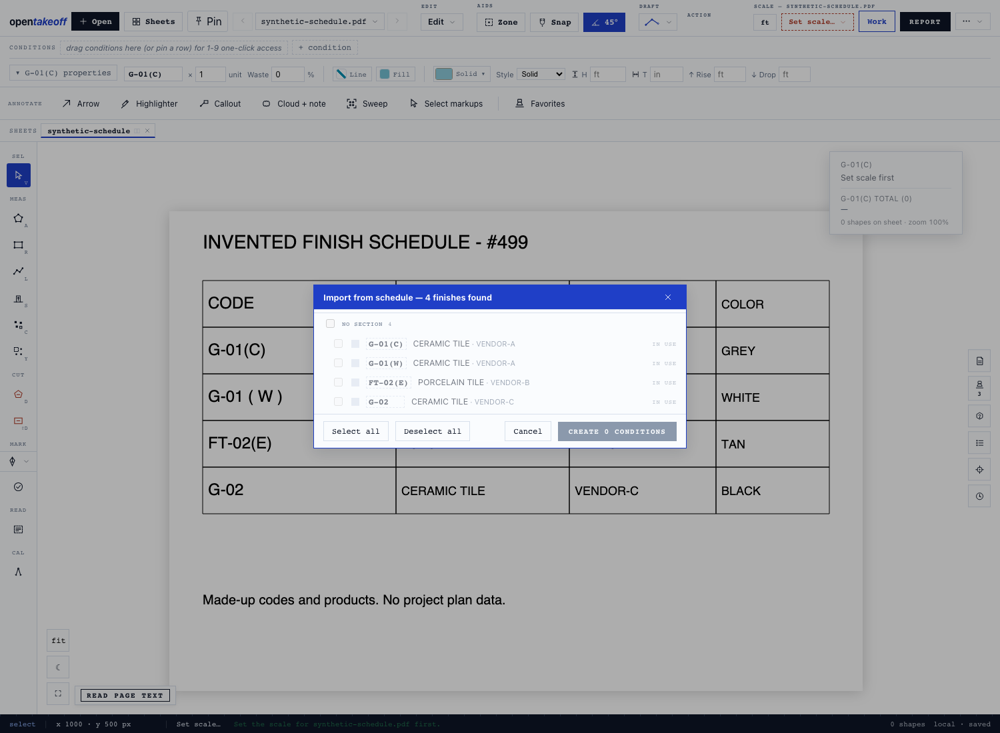
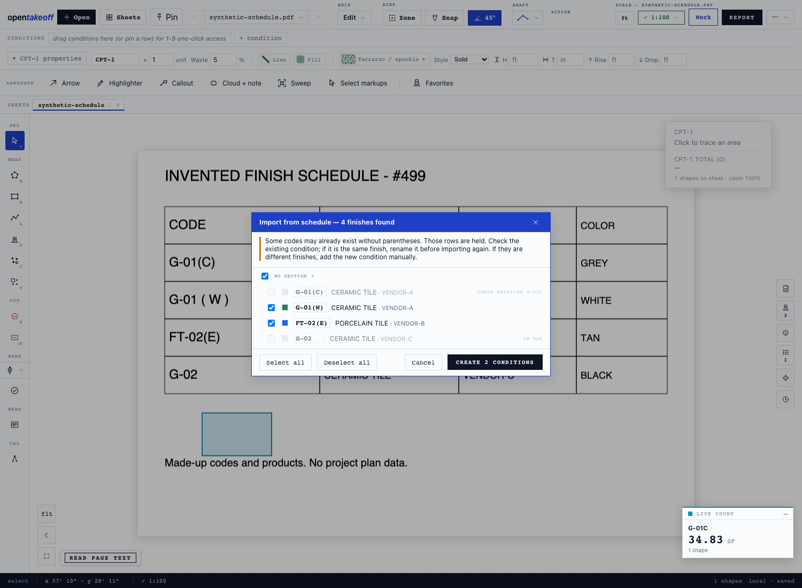
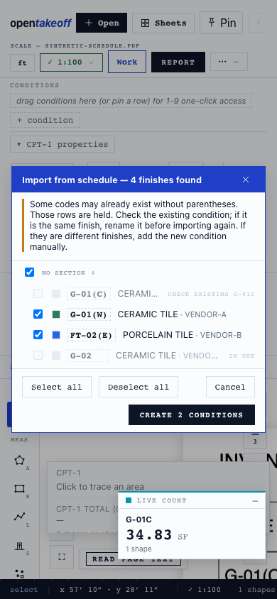

# Parenthesized finish codes — #499 review evidence

`G-01(C)` and `FT-02(E)` retain their parentheses through native and OCR
schedule reads. Spaced suffixes normalize to the same identity. A possible
older flattened condition is held for review; no automatic rename or merge
changes existing conditions, IDs or measurements.

All files in this directory are invented fixtures and local-browser captures.
No private plans or prices are included. Tested on main `788e39bf` plus this
change, Node 24.18.0 and Chromium 153.0.8010.12, October 3, 2026.

| Check | Expected | Observed |
|---|---|---|
| First import, synthetic PDF | Four codes, parentheses retained | 4/4 |
| Re-import, Select all | All four in use, create zero | 4 in use; Create 0 |
| Older `G-01C` and existing `G-02` | Hold `(C)` and `G-02`; create `(W)` and `(E)` | Create 2 |
| Save/reload after that import | 11 original conditions unchanged | 11/11 unchanged; 13 total |
| Existing measurement | Same ID, condition reference, vertices and computed values | Entire shape object unchanged; 34.83 SF |
| 390 px viewport | Notice and controls fit | Dialog scroll width = client width, 356 px |

[Machine-readable UI observations](ui-results.json).






## Reproduce

```sh
npm ci --prefix web
npm run check --prefix web
cd web
node --import tsx --test test/finishSuffix.test.ts test/keyCell483.test.ts test/ocrWordClean.test.ts test/scheduleRead482.test.ts
npm run dev
```

1. In a fresh browser profile, open [synthetic-schedule.pdf](synthetic-schedule.pdf).
   In the classic layout, choose **⋯ → Import from schedule** and click two
   corners around the table, header included. Expect `G-01(C)`, `G-01(W)`,
   `FT-02(E)` and `G-02`. Create four conditions.
2. Read the same box again and select all. All four are **in use**; Create is zero.
3. For the historical-import case, load [legacy.takeoff.json](legacy.takeoff.json)
   with **Import takeoff** against the same PDF, or create an existing `G-01C`
   condition and `G-02` manually. The saved fixture has 11 conditions and one
   rectangle measuring 34.83 SF, assigned to `G-01C`. It was made from the app's
   saved state, with the printed code flattened to simulate the older reader.
4. Import the table and select all. `G-01(C)` says **check existing G-01C**;
   `G-02` is **in use**. Create adds only `(W)` and `(E)`. Reload: 13 conditions,
   the original condition records and measurement unchanged. The automated
   capture seeded this same fixture through IndexedDB before reloading.
5. If `G-01C` is the same finish, rename that existing condition to `G-01(C)`
   before importing again. If the printed codes represent distinct finishes,
   add the new condition manually. Tests cover exact re-import after renaming,
   duplicate edited tags, compounds, NOT USED, actual qualifier words and OCR
   digit repairs that must preserve suffix characters.

Validation: full web check passed (3,152 passed, 3 skipped); MCP typecheck and
286 tests passed; protocol 61 tests, tool-count, wiki and doc-link checks passed.
The added malformed-OCR case also passed the focused suffix tests. Source-backed
user documentation explains the hold and its resolution.

## Real-plan replay and limits

A local-only replay of 52 saved OCR results from earlier real-plan reviews gave
48 unchanged reader results. The four changed results contain 29 now-preserved
parenthesized codes. Total rows changed from 279 to 278 because one historical
read, `FT-OB(C`, lacked a closing parenthesis: it is no longer flattened into
`FT-OBC`. This is saved-OCR parser replay, not fresh OCR or 52 independent plans.
Private images and OCR text remain local, so these aggregate counts are not
independently reproducible from this public directory.

Malformed suffixes are not recovered by this change and may be left unread or
absorbed into a neighboring row's description. Check the source and add/correct
that finish manually. This PR fixes valid printed suffixes and browser schedule
re-import identity; it does not fix OCR character recognition or header detection.
