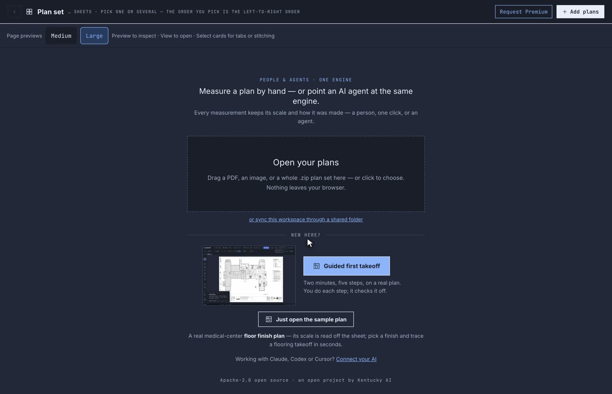
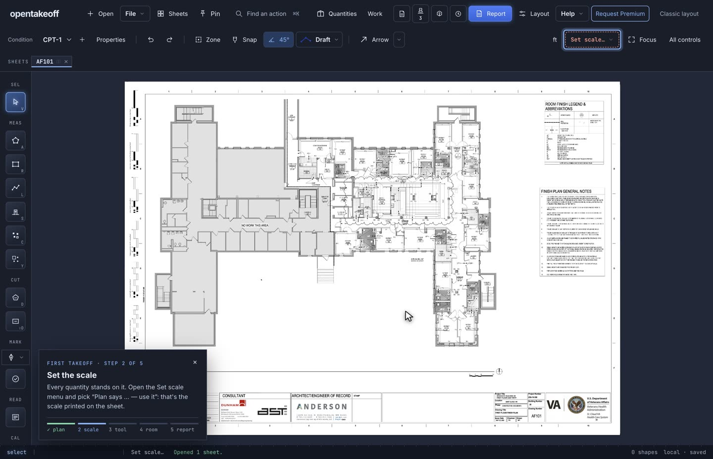
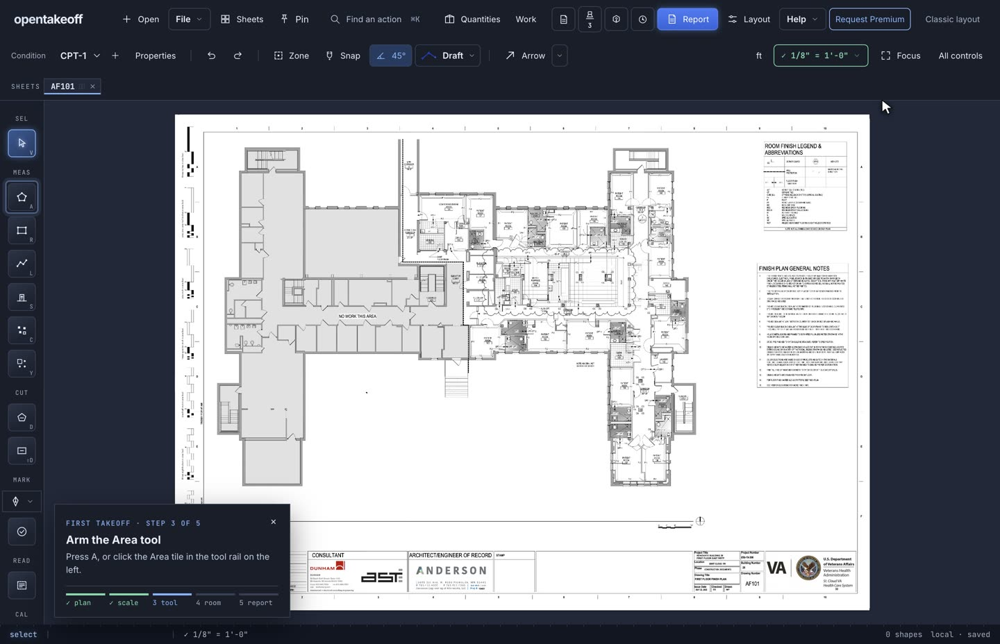
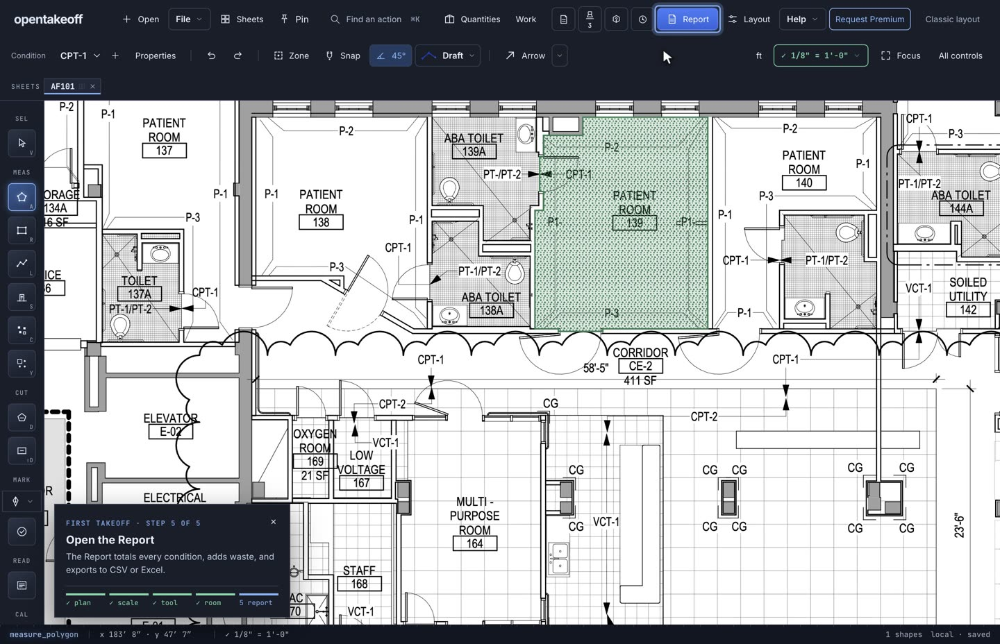
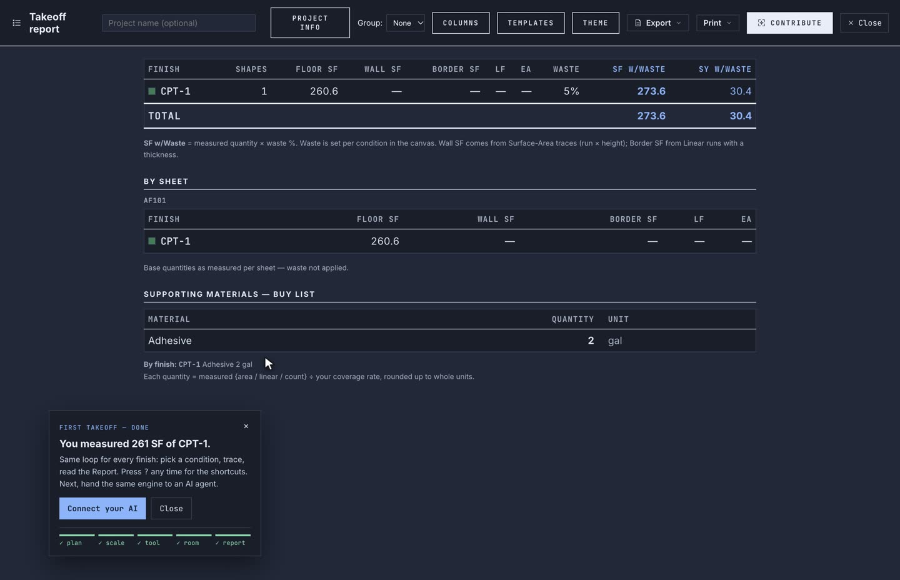
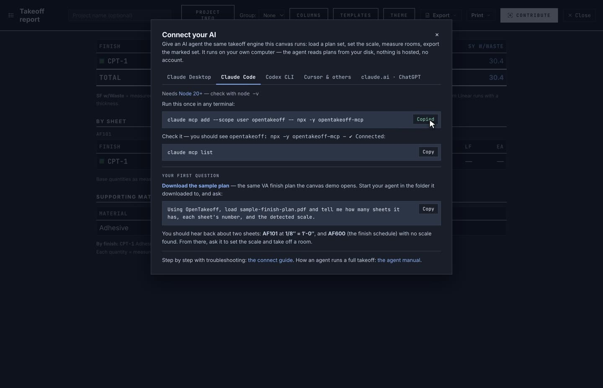

# Review evidence — guided first takeoff and Connect your AI

Stills from one real run, recorded from the dev build of this branch at a 1440 × 928 viewport.
The plan is the bundled demo (`web/public/demo/sample-finish-plan.pdf`, VA St. Cloud, AF101).
Nothing is staged except the drawn cursor. The same run, at 2× speed, is the clip the opening
screen plays (`web/public/demo/first-takeoff.mp4`).

| | |
|---|---|
|  | **Opening screen.** *Guided first takeoff* with the recorded run looping beside it; *Just open the sample plan* and *Connect your AI* below. |
|  | **Step 1 done on its own** when the plan opened; step 2 outlines the scale chip. |
|  | After *Plan says 1/8″ = 1′-0″ — use it*: step 3 outlines the Area tile. |
|  | Patient room 139 traced on its inside wall faces: 16 vertices taken from the sheet's own vector strokes (`get_sheet_vectors`), wrapping the chase at the top left and the wall end at the toilet door, both doors crossed on the wall line. Step 5 outlines Report. |
|  | The Report: CPT-1, 1 shape, **260.6 SF** (273.6 SF / 30.4 SY with 5% waste). The same ring through the MCP engine (`measure_polygon`) measures 260.59 SF. The done card sits over it: "You measured 261 SF of CPT-1." |
|  | *Connect your AI* from the done card, Claude Code tab, after *Copy*. |

## What was checked, and how

**Step logic** — `web/test/firstTakeoff.test.ts`, 8 tests, part of `npm run check` (green: 3406
pass, 0 fail, 4 skipped). Covers: steps complete in order on the real action; Rectangle counts as
a floor tool; steps never un-complete; shapes that existed before the tour don't count; the
Report before a trace doesn't complete; cut-outs and zero-area shapes aren't floor shapes.

**In the running app** (`cd web && npm run dev`), all observed:

- Opening screen → *Guided first takeoff*: sample loads, step 1 checks itself, the card lands on
  step 2 with the scale chip outlined. Same from **Help** (workspace header), the classic **⋯**
  menu, and ⌘K.
- Started with a room already on the sheet: steps 1–2 checked themselves, the old room didn't
  count, a second room (147, 159.3 SF; Report total 403.4 = 244.1 + 159.3) did.
- In the classic layout the scale spotlight finds the classic chip.
- The done card shows over the full-screen Report; the in-progress card hides under the guide and
  Connect dialogs.
- *Connect your AI*: opens from the opening screen, the done card, Help, ⋯ and ⌘K; Esc closes it
  (including over the plan navigator); *Copy* put
  `claude mcp add --scope user opentakeoff -- npx -y opentakeoff-mcp` on the clipboard verbatim.
- The opening-screen clip autoplays muted in a focused window (`readyState` 4); under
  `prefers-reduced-motion` it shows the poster with controls instead.

**The panel's first question, run for real** (the expected answer is the panel's own sentence):

```bash
mkdir firstask && cd firstask
curl -LO https://github.com/Kentucky-ai/opentakeoff/raw/main/demo/sample-finish-plan.pdf
echo '{"mcpServers":{"opentakeoff":{"command":"npx","args":["-y","opentakeoff-mcp"]}}}' > mcp.json
claude -p "Using OpenTakeoff, load sample-finish-plan.pdf and tell me how many sheets it has, each sheet's number, and the detected scale." \
  --strict-mcp-config --mcp-config mcp.json \
  --allowedTools=mcp__opentakeoff__load_plan,mcp__opentakeoff__sheet_info,mcp__opentakeoff__sheet_context < /dev/null
```

| Route | Server | Answer |
|---|---|---|
| Terminal (npm `opentakeoff-mcp` 0.9.96, relative path) | `npx -y opentakeoff-mcp` | 2 sheets — AF101 at 1/8″ = 1′-0″, AF600 none detected |
| Claude Desktop bundle (`opentakeoff-mcp.mcpb` 0.9.96 from `releases/latest/download`, unzipped, full path) | `node dist/server.js` | same |
| Codex CLI (throwaway `CODEX_HOME`) | `codex mcp add opentakeoff -- npx -y opentakeoff-mcp`, then `codex mcp list` | listed, enabled |

## Not verified

- Claude Desktop's own double-click install prompt. The bundle's server was run directly, as its
  manifest launches it; the GUI install was not driven.
- Cursor's `mcp.json` route (the JSON is the same entry the terminal runs used).
- Light chrome, and phone widths.
