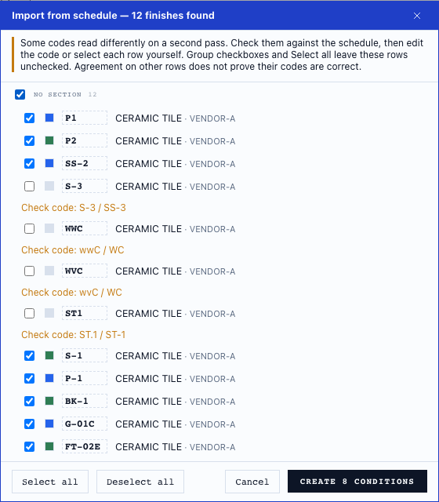
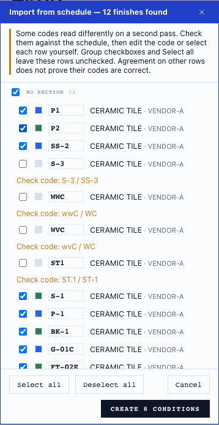
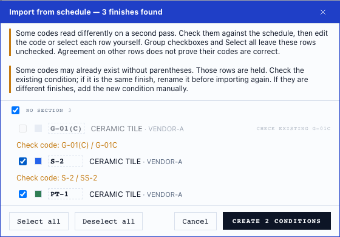
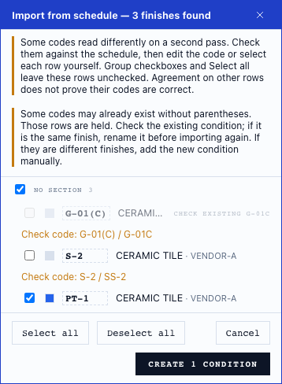

# Public OCR code fixtures (#500)

These four invented finish schedules turn dropped-letter and punctuation mistakes
into reusable inputs for an OCR fix. The expected result is the printed code in
each of 48 cells. All text is made up; there are no construction-plan pixels,
project names, prices or bundled fonts. The frozen PNGs and their SHA-256 hashes
live beside [per-cell ground truth](../../test/fixtures/ocr-codes/truth.json).

This is a selected stress set, not an estimate of accuracy on real plans. It does
not reproduce the exact private `P1 → P` image. It reproduces the failure class
with public images, including `SS-2 → S-2`, `SS-3 → S-3` and `P-1 → P.1`.

These images stand in for **scanned** sheets specifically. On-device reads of a
PDF render at 216 DPI (`OCR_TARGET_DPI`, `web/src/lib/ocr/rasterize.ts`), and
three of these images are 100 DPI. In a review of #509, @knmurphy re-rendered
them at 216 DPI with the same generator: the `SS-2 → S-2` and `SS-3 → S-3`
drops went away and the Avenir image kept two hyphen-to-period errors. Upscaled
from 100 to 216 DPI without smoothing, the way a low-resolution scan comes in,
several confident misreads came back. Not re-measured here.

## Measured baseline

Measured October 3, 2026 from main `788e39bf`, ppu-paddle-ocr 6.6.0,
the staged manifest/model revision and shipped engine options recorded in the
JSON files. Native: macOS arm64 / Node 24.18.0. Browser: headless Chromium 153.0.8010.12,
production OCR client and worker, ORT WASM, PNG RGBA input at zoom 1.
This bypasses PDF rasterization and schedule parsing, isolating recognition.

| Check | Expected | Native observed | Browser observed |
|---|---:|---:|---:|
| Exact cell identities | 48/48 | 38/48 | 37/48 |
| Arial 216 DPI control | 12/12 | 12/12 | 12/12 |
| Wrong single-box reads at confidence ≥0.95 | 0 | 4 | 4 |
| Wrong single-box reads at confidence ≥0.99 | 0 | 1 | 1 |
| Missing code cells | 0 | 0 | 0 |

| Image / printed code | Native read / confidence | Browser read / confidence |
|---|---|---|
| Times New Roman 100 DPI / `SS-2` | `S-2` / 0.973945 | `S-2` / 0.9755 |
| Arial Narrow 100 DPI / `SS-3` | `S-3` / 0.969499 | `S-3` / 0.9813 |
| Avenir Next Condensed 100 DPI / `P-1` | `P.1` / 0.992381 | `P.1` / 0.9917 |

Full evidence: [native](baseline-native.json), [browser worker](baseline-browser.json).
The browser has one additional low-confidence `P-1 → P.1` error in the Times
image. Backend results and confidence values need not agree exactly.


## Reproduce

From `web/`, with the repository's Node 24 version:

```sh
npm ci
node scripts/stage-ocr-model.mjs
node --import tsx --test test/ocrCodeFixtures.test.ts
node --import tsx scripts/measure-ocr-code-fixtures.mjs /tmp/ocr-native.json
# Exact-recognition gate: still exits 1 for known misreads.
node --import tsx scripts/measure-ocr-code-fixtures.mjs /tmp/ocr-native.json --strict
```

Run the shipped browser worker against the same bytes:

```sh
npx vite build --config bench/ocr-codes/vite.config.mjs
npx vite preview --outDir dist-ocr-codes --port 4174
```

Open `http://localhost:4174/bench/ocr-codes/index.html`, click **Read fixtures**,
then **Save evidence JSON**. Uncheck **Check short codes before import** to measure the original read alone. The button authorizes loading the staged models
from that local build. The worker uses the same models and engine options as
the application. This separate benchmark entry is not part of the app build.

Scoring assigns each recognized box by its center to the matching truth cell.
It keeps punctuation and compares to that row's identity, so `P1` read in the
`P-1` row is wrong even though `P1` is another valid row. Missing cells are
errors. Descriptions do not score as keys. Split boxes have no aggregate
confidence; the threshold counts concern single-box codes only. No threshold
is proposed as a safe acceptance rule.

The tests guard hashes, dimensions and scoring errors. They do not assert that
the OCR must keep making these mistakes. The optional strict runner requires
all expected codes; baseline JSON records known failures until a fix improves
them. The disagreement check below flags unstable readings without changing primary recognition accuracy. The original baseline files remain unchanged.

## Disagreement check

The production schedule-box reader now requests a second recognition view of
short code-shaped boxes: the same detected crop stretched horizontally by 2,
using the same recognizer and models. Detection and the primary text, geometry
and confidence are unchanged. Disagreement metadata is carried to the import
reader. Every scanned code now starts unchecked and requires individual review
or correction, including a clean control or a stable wrong reading. A disagreement
also shows both readings. **Select all** and group checkboxes skip unverified rows. The user can
correct its code or select that row individually. The alternate is never chosen
automatically: one fixture's `WWC` rereads as `WC`, and both are wrong.

| Check | Native | Browser worker |
|---|---:|---:|
| Primary exact cells (unchanged) | 38/48 | 37/48 |
| Wrong cells with a disagreement / wrong cells | 10/10 | 11/11 |
| Wrong cells without a disagreement in this set | 0 | 0 |
| Correct cells with a disagreement | 2/38 | 3/37 |
| Clean Arial control exact / flagged | 12/12 / 0 | 12/12 / 0 |

Evidence: [native checked run](checked-native.json),
[browser checked run](checked-browser.json), [dialog assertions and timings](ui-check.json).
These are selected stress images, not a real-plan accuracy estimate. The public
images isolate recognition; the table reader does not extract a schedule from
all four tiny images. A word-level flag does not prove that its row imports.

The candidate check accepts short letter/digit code shapes (including a single
surviving letter and numeric misreads), at most 16 non-space characters, up to
1024 × 256 pixels. Prose, merged code-and-description boxes and missing detections
are not recovered. A consistently wrong second reading has no disagreement marker, but its
import row still requires individual review. Agreement is not verification. Page OCR, cached text, Copy text, native text-layer
imports and the agent's text-layer reader do not request this pass.

Warm browser runs over all four images took a median **6.07 → 7.32 seconds**
with the check off/on (**20.7%** more, three paired runs on macOS arm64,
Chromium 153.0.8010.12). Model loading is excluded. This is the small fixture
set, not a full-sheet latency claim. Other checks were running on the same
machine; these are observed paired timings, not an isolated performance benchmark.

### Reproduce the check and dialog

```sh
# From web/, after npm ci and staging models as above:
node --import tsx --test test/ocrCodeCheck.test.ts test/ocrWorkerCore.test.ts test/ocrSeams.test.ts
node --import tsx scripts/measure-ocr-code-fixtures.mjs /tmp/ocr-checked.json --check-codes --require-flagged
npx vite build --config bench/ocr-codes/vite.config.mjs
# Optional browser automation, installed outside the repository:
npm install --prefix /tmp/ot-browser-review playwright
/tmp/ot-browser-review/node_modules/.bin/playwright install chromium
PLAYWRIGHT_MODULE=/tmp/ot-browser-review/node_modules/playwright/index.mjs node scripts/verify-ocr-code-dialog.mjs /tmp/ocr-code-review
```

`--require-flagged` fails if any wrong cell is unflagged or any correct control
cell is flagged. `--strict` still fails because the primary reads remain wrong.
The browser script checks all wrong cells are flagged, the control stays clean,
and every primary cell remains unchanged with checks on versus off. It warms
the models, records three paired runs, then checks bulk, group and individual
selection, editing `S-3` to `SS-3`, creation, and mobile overflow. `BROWSER_PATH`
can select an installed browser; record its version when comparing. The script
blocks external requests, including the app's Google Fonts request, so these
screenshots use system fallback fonts.

**Dialog evidence uses a constructed table.** Actual OCR code readings from
Arial Narrow 100 DPI are placed under invented CODE / MATERIAL / MANUFACTURER /
COLOR spans. Code readings and disagreement metadata are unchanged; headings,
descriptions and layout are constructed. This exercises parser-to-dialog
behavior separately from recognition, not table extraction from the PNG.
All 12 displayed rows require review; four also show disagreeing readings
(three wrong codes and one correct code). Bulk selection leaves all 12 unchecked.




### Combined import safeguards (#499 + #500)

PR #511 now follows #510, which follows the public fixtures in #509. The import
dialog conflict is resolved with both notices and both selection guards present.
The browser reproduction command above also runs a separate constructed
three-row case. An existing `G-01C` keeps incoming `G-01(C)` locked even though
that row also has an OCR disagreement. **Select all** picks none.
Individually accepting `S-2` and `PT-1` creates those two, with no duplicate
`G-01(C)`. Both notices fit at 390 px with no horizontal overflow. This interaction
case uses invented spans and disagreement metadata; it is not an OCR measurement.

[Current combined assertions](ui-check.json). [Earlier combined assertions](combined-ui-check.json)
record the previous disagreement-only selection behavior. Render tests also check that skipped-code,
OCR and historical-identity notices each keep their own accessible description.




### Fresh real-schedule spot check

Two private schedule crops were reread locally through the production 216-DPI
tiled box path after the remaining-case changes. The first still returns no table
because of its existing header/layout limit. The second now returns **9 review
rows instead of 8**: the numeric-only omitted code becomes an unnamed row with
its product cells and both readings. The eight established identities remain,
and every parsed raster code requires individual review. Primary recognition
remains 164 + 68 words; this is a parsing/acceptance safeguard, not an OCR accuracy
claim. [Aggregate results](private-aggregate.json) contain no private content. Private
pixels, document text, project names and file paths stay local.
These two spot checks are not a public reproducible corpus; use the invented
regressions below to reproduce the failure classes.

## Image provenance

[The generator](../../scripts/make-ocr-code-fixtures.mjs) draws 7 pt type in
20 pt rows, a 65 pt key column and 195 pt description column, with the code
2 pt from the left rule. Three images use 100 DPI; the Arial control uses
216 DPI. Font families, weights, dimensions and row rectangles are recorded
in the truth JSON. Only raster output is distributed. Tests read these frozen
images and need no OS fonts.

The generator draws each family at the weight it asks for only when the OS
font provides that face. On macOS, `@napi-rs/canvas` finds only the bold (700)
face of Avenir Next Condensed, so the image labelled 400 renders bold
(reported in the #509 review).

```sh
# Requires the listed fonts, macOS canvas rendering used for the baseline.
# Writes separately and prints matches/DIFFERS; never silently replaces truth.
node scripts/make-ocr-code-fixtures.mjs /tmp/ocr-regenerated
```

All four hashes matched when regenerated on the capture machine. Another OS
or font version can draw different pixels; retain the frozen fixtures for
comparisons, or review a deliberate fixture revision with new hashes.

## Remaining edge cases: stable agreement and dropped numeric rows

All parsed raster codes now require individual verification, including the 12/12
clean control. This adds review work; it does **not** improve primary recognition
accuracy. Native text-layer rows keep their original default/bulk selection.
The public browser runner tests a constructed stable `P-110` agreement: Select all
cannot select it; an individual check can. This is an explicit acceptance by the
person, not evidence that `P-110` was read correctly.

A numeric-only misread (`88-2`, second read `SS-2`) inside an accepted finish
key column can identify an omitted row. A guarded reparse must preserve every
existing key in order. The recovered row retains its product cells and shows
both readings, but its identity is empty (**set code**) and its checkbox disabled.
Only a person's edit supplies the identity. A Node test excludes numeric values
in manufacturer cells and refuses a door schedule. No numeric row is recovered
without a usable second reading or recognized table. Missing detections and
unreadable headers remain limitations.

Reproduce the focused lifecycle of a code through parsing and selection:

```sh
node --import tsx --test test/ocrCodeCheck.test.ts test/importSchedulePanel.test.ts
npx vite build --config bench/ocr-codes/vite.config.mjs
PLAYWRIGHT_MODULE=/path/to/playwright-core/index.mjs BROWSER_PATH=/path/to/chromium \
  node scripts/verify-ocr-code-dialog.mjs bench/ocr-codes
```

[Remaining-case screenshot](remaining-cases.png) and [browser assertions](ui-check.json)
exercise the actual import dialog. The table geometry and stable-agreement case
are constructed, not claims about pixel recognition. The four frozen image
fixtures continue to measure the production worker independently.
