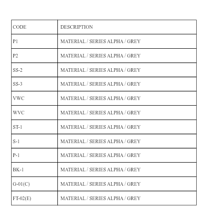

# Public OCR code fixtures (#500)

These four invented finish schedules turn dropped-letter and punctuation mistakes
into reusable inputs for an OCR fix. The expected result is the printed code in
each of 48 cells. All text is made up; there are no construction-plan pixels,
project names, prices or bundled fonts. The frozen PNGs and their SHA-256 hashes
live beside [per-cell ground truth](../../test/fixtures/ocr-codes/truth.json).

This is a selected stress set, not an estimate of accuracy on real plans. It does
not reproduce the exact private `P1 → P` image. It reproduces the failure class
with public images, including `SS-2 → S-2`, `SS-3 → S-3` and `P-1 → P.1`.

These images stand in for **scanned** sheets specifically. On-device reads of a
PDF render at 216 DPI (`OCR_TARGET_DPI`, `web/src/lib/ocr/rasterize.ts`), and
three of these images are 100 DPI. In a review of #509, @knmurphy re-rendered
them at 216 DPI with the same generator: the `SS-2 → S-2` and `SS-3 → S-3`
drops went away and the Avenir image kept two hyphen-to-period errors. Upscaled
from 100 to 216 DPI without smoothing, the way a low-resolution scan comes in,
several confident misreads came back. Not re-measured here.

## Measured baseline

Measured October 3, 2026 from main `788e39bf`, ppu-paddle-ocr 6.6.0,
the staged manifest/model revision and shipped engine options recorded in the
JSON files. Native: macOS arm64 / Node 24.18.0. Browser: headless Chromium 153.0.8010.12,
production OCR client and worker, ORT WASM, PNG RGBA input at zoom 1.
This bypasses PDF rasterization and schedule parsing, isolating recognition.

| Check | Expected | Native observed | Browser observed |
|---|---:|---:|---:|
| Exact cell identities | 48/48 | 38/48 | 37/48 |
| Arial 216 DPI control | 12/12 | 12/12 | 12/12 |
| Wrong single-box reads at confidence ≥0.95 | 0 | 4 | 4 |
| Wrong single-box reads at confidence ≥0.99 | 0 | 1 | 1 |
| Missing code cells | 0 | 0 | 0 |

| Image / printed code | Native read / confidence | Browser read / confidence |
|---|---|---|
| Times New Roman 100 DPI / `SS-2` | `S-2` / 0.973945 | `S-2` / 0.9755 |
| Arial Narrow 100 DPI / `SS-3` | `S-3` / 0.969499 | `S-3` / 0.9813 |
| Avenir Next Condensed 100 DPI / `P-1` | `P.1` / 0.992381 | `P.1` / 0.9917 |

Full evidence: [native](baseline-native.json), [browser worker](baseline-browser.json).
The browser has one additional low-confidence `P-1 → P.1` error in the Times
image. Backend results and confidence values need not agree exactly.



## Reproduce

From `web/`, with the repository's Node 24 version:

```sh
npm ci
node scripts/stage-ocr-model.mjs
node --import tsx --test test/ocrCodeFixtures.test.ts
node --import tsx scripts/measure-ocr-code-fixtures.mjs /tmp/ocr-native.json
# Acceptance gate for a future fix: currently exits 1 for known misreads.
node --import tsx scripts/measure-ocr-code-fixtures.mjs /tmp/ocr-native.json --strict
```

Run the shipped browser worker against the same bytes:

```sh
npx vite build --config bench/ocr-codes/vite.config.mjs
npx vite preview --outDir dist-ocr-codes --port 4174
```

Open `http://localhost:4174/bench/ocr-codes/index.html`, click **Read fixtures**,
then **Save evidence JSON**. The button authorizes loading the staged models
from that local build. The worker uses the same models and engine options as
the application. This separate benchmark entry is not part of the app build.

Scoring assigns each recognized box by its center to the matching truth cell.
It keeps punctuation and compares to that row's identity, so `P1` read in the
`P-1` row is wrong even though `P1` is another valid row. Missing cells are
errors. Descriptions do not score as keys. Split boxes have no aggregate
confidence; the threshold counts concern single-box codes only. No threshold
is proposed as a safe acceptance rule.

The tests guard hashes, dimensions and scoring errors. They do not assert that
the OCR must keep making these mistakes. The optional strict runner requires
all expected codes; baseline JSON records known failures until a fix improves
them. This PR adds fixtures and measurement, not a recognition fix for #500.

## Image provenance

[The generator](../../scripts/make-ocr-code-fixtures.mjs) draws 7 pt type in
20 pt rows, a 65 pt key column and 195 pt description column, with the code
2 pt from the left rule. Three images use 100 DPI; the Arial control uses
216 DPI. Font families, weights, dimensions and row rectangles are recorded
in the truth JSON. Only raster output is distributed. Tests read these frozen
images and need no OS fonts.

The generator draws each family at the weight it asks for only when the OS
font provides that face. On macOS, `@napi-rs/canvas` finds only the bold (700)
face of Avenir Next Condensed, so the image labelled 400 renders bold
(reported in the #509 review).

```sh
# Requires the listed fonts, macOS canvas rendering used for the baseline.
# Writes separately and prints matches/DIFFERS; never silently replaces truth.
node scripts/make-ocr-code-fixtures.mjs /tmp/ocr-regenerated
```

All four hashes matched when regenerated on the capture machine. Another OS
or font version can draw different pixels; retain the frozen fixtures for
comparisons, or review a deliberate fixture revision with new hashes.
